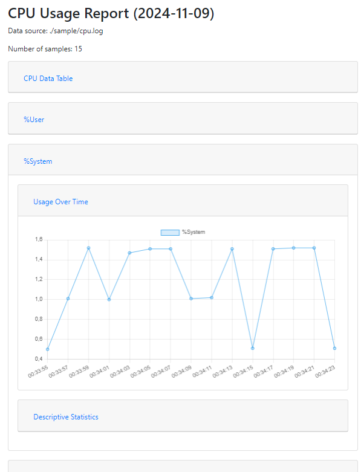

# SAR CPU Data Analyzer
A python project that can be used to analyze, test and visualize the CPU data from the SAR command. The project can also be used to run automated tests on the CPU data using GitHub Actions.

## Setup
```bash
# Create a virtual environment
python -m venv venv

# Activate the virtual environment
source venv/bin/activate 2>/dev/null || venv\Scripts\activate 2>/dev/null || source venv/Scripts/activate 2>/dev/null && echo "Virtual environment activated." || echo "Failed to activate virtual environment."

# Install the dependencies
pip install -r requirements.txt
```

## Example CPU Data
```bash
Linux 6.11.0-9-generic (ubuntu-s-1vcpu-2gb-ams3-01)     11/09/24        _x86_64_        (1 CPU)

00:33:53        CPU     %user     %nice   %system   %iowait    %steal     %idle
00:33:55        all      2.01      0.00      0.50      0.50      0.00     96.98
00:33:57        all      1.52      0.00      1.01      0.00      0.51     96.97
00:33:59        all      2.53      0.00      1.52      0.00      0.00     95.96
00:34:01        all      2.50      0.00      1.00      0.00      2.00     94.50
00:34:03        all      2.45      0.00      1.47      0.00      3.92     92.16
00:34:05        all      2.51      0.00      1.51      0.00      0.00     95.98
00:34:07        all      2.51      0.00      1.51      0.00      0.00     95.98
00:34:09        all      2.02      0.00      1.01      0.51      0.51     95.96
00:34:11        all      2.04      0.00      1.02      0.00      0.00     96.94
00:34:13        all      2.51      0.00      1.51      0.00      0.00     95.98
00:34:15        all      2.53      0.00      0.51      0.00      0.51     96.46
00:34:17        all      2.51      0.00      1.51      0.00      0.00     95.98
00:34:19        all      2.02      0.00      1.52      4.04      0.00     92.42
00:34:21        all      2.02      0.00      1.52      0.00      0.51     95.96
00:34:23        all      0.51      0.00      0.51      0.00      0.00     98.99
```

## Write and run tests
The CPU data can be tested using a simple JSON file specifying the expected results.
For example, the following JSON file specifies the expected results for the CPU data in the example above.
```json
{
    "User mean must be less than 1": { 
        "%User": { "mean": { "<": 1 } }
    },
    "Nice median must be greater than 1": { 
        "%Nice": { "median": { ">": 1 } }
    },
    "System max must equal 1": { 
        "%System": { "max": { "=": 1 } }
    },
    "iowait mean must be greater than or equal to 1": { 
        "%IOWait": { "mean": { ">=": 1 } }
    },
    "steal min must be less than or equal to 1": { 
        "%Steal": { "min": { "<=": 1 } }
    },
    "idle sum must not equal 1": {
        "%Idle": { "sum": { "!=": 1 } }
    }
}
```
The JSON file is saved as `tests.json` and the CPU data is saved as `cpu.log`. The tests can be run as follows:
```bash
# Command
python main.py -i <input_file> -t <tests_file> -j <output_result_file>

# Run the tests
python main.py -i ./sample/cpu.log -t ./sample/sample-test.json -j ./tests-results.json

# Terminal output:
# User mean must be less than 1: False (Result: 2.1459999999999995, Operator: <, Expected Value: 1)
# Nice median must be greater than 1: False (Result: 0.0, Operator: >, Expected Value: 1)
# System max must equal 1: False (Result: 1.52, Operator: =, Expected Value: 1)
# iowait mean must be greater than or equal to 1: False (Result: 0.33666666666666667, Operator: >=, Expected Value: 1)
# steal min must be less than or equal to 1: True (Result: 0.0, Operator: <=, Expected Value: 1)
# idle sum must not equal 1: True (Result: 1437.2200000000003, Operator: !=, Expected Value: 1)
# Test results saved to: ./tests-results.json
```

## Generate HTML Report
Generate an HTML report that contains the CPU data visualization. The HTML report is currently designed to display a table with the CPU data, line chart for ressource usage over time, and descriptive statistics.



```bash
# Generate the HTML report
python report.py -i <input_file> -r <output_file>

# Help
python report.py --help
```

## Example
```bash
python main.py -i ./sample/cpu.log -r ./report.html
```

## Combine Tests and Report
It is possible to combine the tests and the report generation in a single command.
```bash
# Command
python main.py -i <input_file> -t <tests_file> -j <output_result_file> -r <output_report_file>

# Run the tests and generate the report
python main.py -i ./sample/cpu.log -t ./sample/sample-test.json -j ./tests-results.json -r ./report.html
```

## GitHub Actions
To use the analyzer in a GitHub Actions workflow, see the example below.
```yaml
name: "Test SAR CPU Data Analyzer Action"

on: [push, pull_request]

jobs:
  test-analyzer:
    runs-on: ubuntu-latest
    steps:
      - name: Checkout code
        uses: actions/checkout@v2

      - name: Run SAR CPU Data Analyzer
        uses: niiicolai/sar-cpu-data-analyzer@v1
        with:
          log-file: "./sample/cpu.log"
          test-file: "./sample/sample-test.json"
          output-file: "./test-results.json" 
          html-report: "./test-report.html"
      
      - name: Upload test results
        uses: actions/upload-artifact@v4
        with:
          name: test-results
          path: test-results.json
          if-no-files-found: error
      
      - name: Upload HTML report
        uses: actions/upload-artifact@v4
        with:
          name: test-report
          path: test-report.html
          if-no-files-found: error
```

## Contributing
Pull requests are welcome. For major changes, please open an issue first to discuss what you would like to change.

## License
```
MIT License

Copyright (c) 2024 Nicolai Berg Andersen

Permission is hereby granted, free of charge, to any person obtaining a copy
of this software and associated documentation files (the "Software"), to deal
in the Software without restriction, including without limitation the rights
to use, copy, modify, merge, publish, distribute, sublicense, and/or sell
copies of the Software, and to permit persons to whom the Software is
furnished to do so, subject to the following conditions:

The above copyright notice and this permission notice shall be included in all
copies or substantial portions of the Software.

THE SOFTWARE IS PROVIDED "AS IS", WITHOUT WARRANTY OF ANY KIND, EXPRESS OR
IMPLIED, INCLUDING BUT NOT LIMITED TO THE WARRANTIES OF MERCHANTABILITY,
FITNESS FOR A PARTICULAR PURPOSE AND NONINFRINGEMENT. IN NO EVENT SHALL THE
AUTHORS OR COPYRIGHT HOLDERS BE LIABLE FOR ANY CLAIM, DAMAGES OR OTHER
LIABILITY, WHETHER IN AN ACTION OF CONTRACT, TORT OR OTHERWISE, ARISING FROM,
OUT OF OR IN CONNECTION WITH THE SOFTWARE OR THE USE OR OTHER DEALINGS IN THE
SOFTWARE.
```
